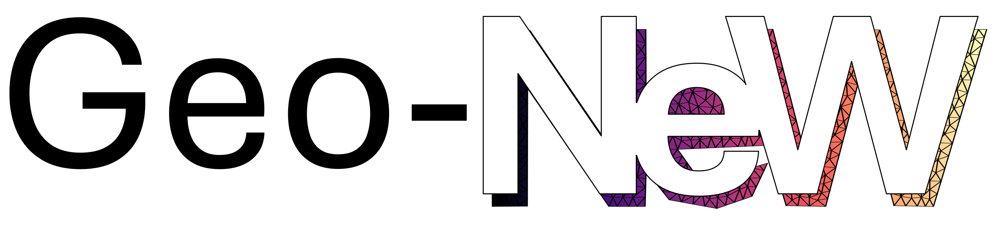

General Geometry Neural Whitney Forms (Geo-New) for PDEs on complex geometries

Code accompanying ICML 2026 Submission **Structure-Preserving Learning Improves Geometry Generalization in Neural PDEs**.

## Abstract:
We aim to develop *physics foundation models* for science and engineering that provide real-time solutions to Partial Differential Equations (PDEs) which preserve structure and accuracy under adaptation to unseen geometries. To this end, we introduce *General-Geometry Neural Whitney Forms* (Geo-NeW): a data-driven finite element method. We jointly learn a differential operator and compatible reduced finite element spaces defined on the underlying geometry. The resulting model is solved to generate predictions, while exactly preserving physical conservation laws through Finite Element Exterior Calculus. Geometry enters the model as a discretized mesh both through a transformer-based encoding and as the basis for the learned finite element spaces. This explicitly connects the underlying geometry and imposed boundary conditions to the solution, providing a powerful inductive bias for learning neural PDEs, which we demonstrate improves generalization to unseen domains. We provide a novel parameterization of the constitutive model ensuring the existence and uniqueness of the solution. Our approach demonstrates state-of-the-art performance on several steady-state PDE benchmarks, and provides a significant improvement over conventional baselines on out-of-distribution geometries.

This repository provides a minimal implementation of the core methodology described in the paper, it will be udpated with a training and evaluations examples shortly.
